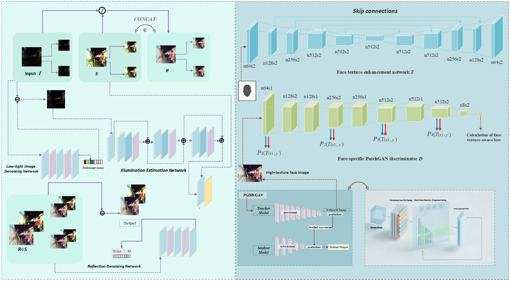
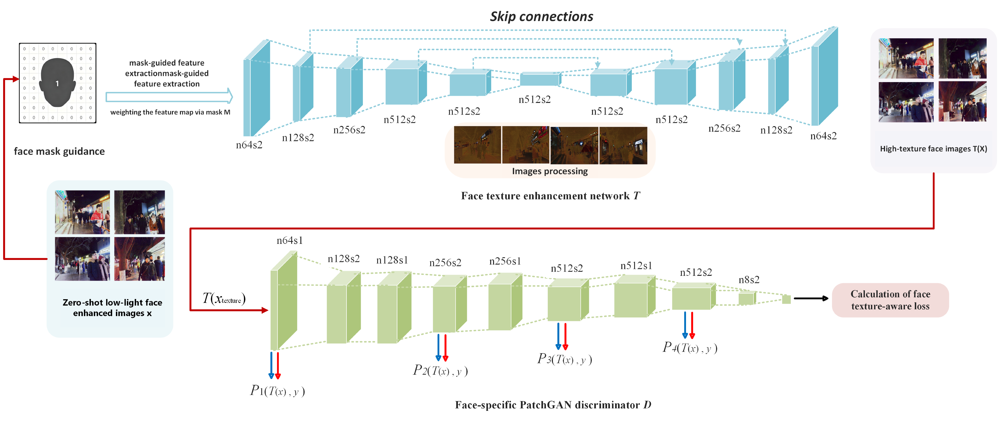
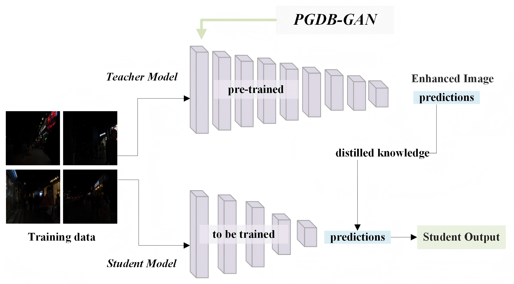
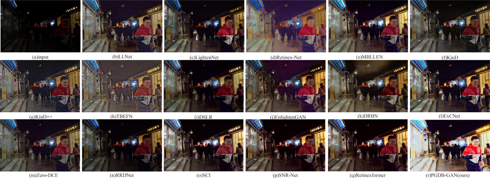
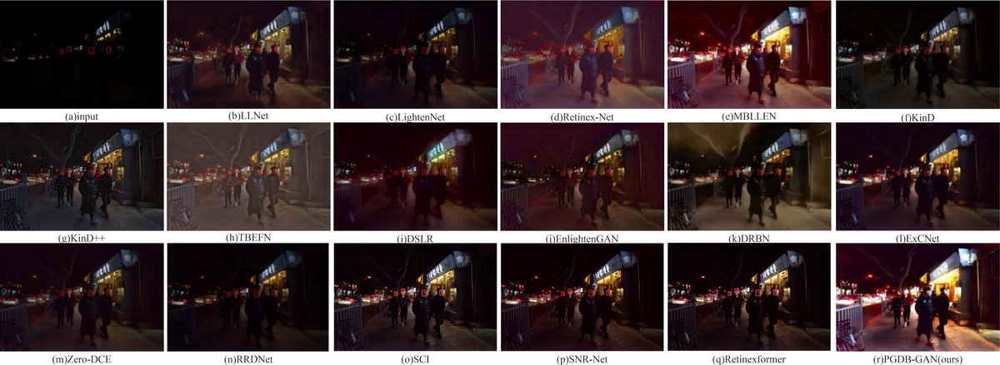
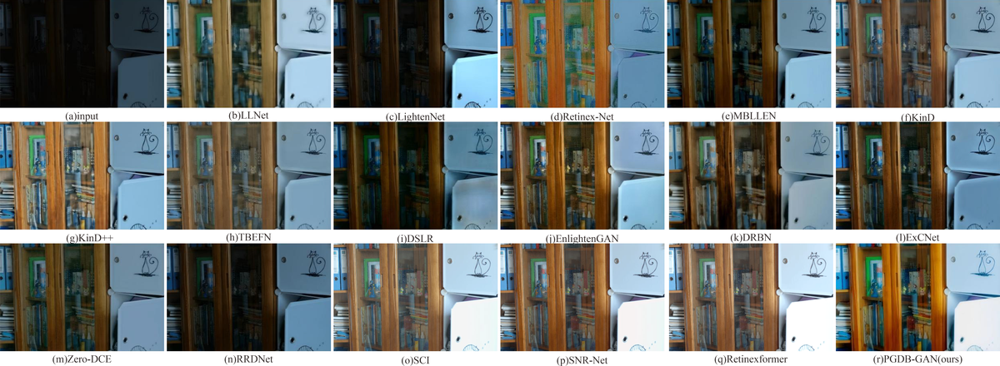
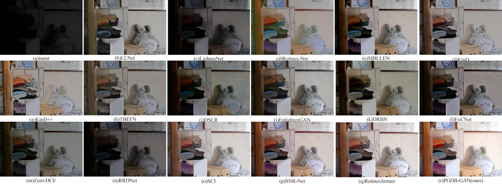
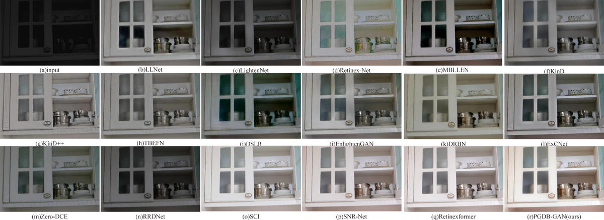
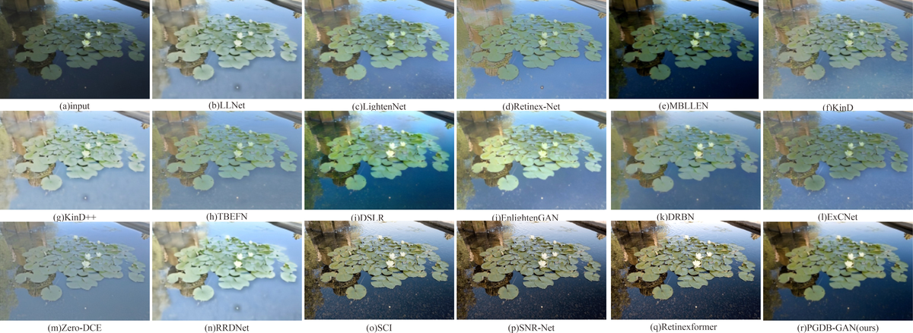

# PGDB-GAN: A Dynamic Enhancement Method for Low-Light Facial Features through Synergy of Physical Illumination and Adversarial Learning

**Official PyTorch Implementation**

[](https://doi.org/10.1016/j.asoc.2026.xxxxx)
[](LICENSE)
[](https://www.python.org/)
[](https://pytorch.org/)

**Authors:** Xianglong Yan, Jin Tao  
**Affiliation:** School of Artificial Intelligence, Gansu University of Political Science and Law, Lanzhou, China  
**Journal:** Applied Soft Computing (Elsevier, SCI Q1)  
**DOI:** https://doi.org/10.1016/j.asoc.2026.xxxxx  
**Repository:** https://github.com/mygithub88888888/PGDB-GAN

---

## Abstract

Complex, low-light environments significantly interfere with the extraction of facial texture features, directly affecting the accuracy of extraction and the effectiveness of applications. This paper proposes a **Physics-Guided, Dual-Branch Generative Adversarial Network (PGDB-GAN)** that establishes a dynamic synergy between physical illumination modeling and adversarial feature learning. Unlike existing sequential Retinex-GAN frameworks, we construct an illumination-reflectance decomposition model to provide real-time spatial guidance for the adversarial enhancement process. This decomposition, achieved through triple constraints—global brightness matching, pixel-wise adaptive adjustment, and illumination smoothness—acts as a physical consistency prior that constrains the search space of the dual-branch GAN, balancing noise suppression and luminance restoration. By adaptively leveraging these illumination priors, the generative adversarial module realizes the collaborative optimization of adversarial loss and content loss to prevent identity distortion in extreme darkness. Furthermore, a face-perceptual distillation module and a dynamic attention mechanism are integrated within this synergistic pipeline, while a Gabor filter bank is adopted to prioritize the preservation of multi-scale facial texture details. Finally, structured pruning and local variance reduction techniques are incorporated for model lightweighting. Extensive experiments demonstrate that our method outperforms other state-of-the-art approaches in both visual quality and facial identity preservation.

---

## Key Contributions

- **Physics-Guided Synergy Framework with Dynamic Spatial Guidance:** Unlike traditional sequential Retinex-GAN methods, we propose a zero-reference framework that establishes a dynamic synergy between physical illumination modeling and adversarial learning. The Retinex-based illumination priors serve as real-time spatial guidance maps that constrain the GAN search space, effectively preventing identity distortion in extreme darkness.

- **Face-Specific Texture-Aware Enhancement via Gabor-Guided Coupling:** By coupling learnable Gabor filters with facial geometric priors, the model adaptively strengthens directional textures in discriminative regions, bridging the "physical-perceptual gap" and ensuring that high-frequency facial details are reconstructed with both structural accuracy and biometric fidelity.

- **Hotspot-Aware Distillation for Identity-Preserving Model Optimization:** Instead of generic feature imitation, our strategy specifically transfers "identity-critical" attention and directional sensitivity from the teacher to a lightweight student network. Combined with structured pruning and Ghost modules, this achieves a balance between real-time inference (3 ms) and high-fidelity facial reconstruction.

---

## Overall Architecture



**Figure 1:** The overall architecture of PGDB-GAN, highlighting the dynamic synergy between physical illumination modeling and facial texture-aware adversarial learning. Unlike sequential pipelines, our framework integrates Retinex-based illumination priors as spatial guidance to constrain the dual-branch GAN enhancement.


**Figure 2:** Detailed network architecture of the decomposition and enhancement branches.



**Figure 3:** Zero-shot Low-light Face Texture Enhancement Framework with Mask Guidance. Comprises face texture enhancement network T (encoder-decoder with skip-connections, mask-guided module) and face-specific PatchGAN discriminator D.



**Figure 4:** Face-aware Gabor feature distillation framework.

---

## Repository Structure

```
PGDB-GAN/
├── src/                          # Core source code
│   ├── model.py                  # Base model: Enhancer, Denoise_1/2, Network, Finetunemodel
│   ├── model_gan.py              # GAN model: Generator and PatchGAN Discriminator
│   ├── loss.py                   # Loss functions: LossFunction, TextureDifference, SmoothLoss, L_TV
│   ├── loss_gan.py               # GAN-specific loss functions
│   ├── utils.py                  # Utility functions: Gaussian kernel, local variance, blur, downsampler
│   ├── utils_gan.py              # GAN utilities: Gabor filters, visualization, checkpoint management
│   ├── dataset.py                # Data loader for paired/unpaired image datasets
│   ├── dataset_gan.py            # GAN data loader with mask support
│   ├── distillation.py           # Face-aware knowledge distillation (Stage 2)
│   ├── pruning.py                # Gabor-driven structured pruning (Stage 3)
│   ├── generate_masks.py         # Preprocessing: face mask generation from annotations
│   ├── data_filter.py            # Data filtering utility based on face ratio
│   └── gan_*.py                  # Additional GAN variant modules
├── scripts/                      # Training and evaluation scripts
│   ├── train_stage1.py           # Stage 1: Base model training
│   ├── train_gan.py              # GAN training script
│   ├── test.py                   # Model inference and evaluation
│   └── test_gan.py               # GAN model testing
├── configs/                      # Configuration files
├── data/                         # Data directory
│   ├── template/                 # Data structure template
│   └── test_images/              # Sample test images
├── weights/                      # Pre-trained model weights
│   ├── LOL.pt                    # Pre-trained on LOL dataset
│   ├── LSRW-Huawei.pt            # Pre-trained on LSRW-Huawei subset
│   └── LSRW-Nikon.pt             # Pre-trained on LSRW-Nikon subset
├── figures/                      # Paper figures (PDF + PNG)
├── results/                      # Output directory for results
│   └── checkpoints/              # Model checkpoints
├── train_results/                # Representative training results
├── test_results/                 # Representative test results
├── requirements.txt              # Python dependencies
├── README.md                     # This file
└── LICENSE                       # MIT License
```

---

## Module Descriptions

### Core Model (`src/model.py`)

| Class | Description |
|-------|-------------|
| `Denoise_1` | Single-stage denoising network for initial noise suppression |
| `Denoise_2` | Two-stage denoising network processing concatenated illumination-reflectance pairs |
| `Enhancer` | Multi-layer convolutional enhancement network with residual connections |
| `Network` | Full PGDB-GAN model integrating denoising, enhancement, and Retinex decomposition |
| `Finetunemodel` | Lightweight inference model loading pre-trained weights for deployment |

### Loss Functions (`src/loss.py`)

| Class | Description |
|-------|-------------|
| `LossFunction` | Composite loss integrating enhancement, reconstruction, color, illumination, and variance constraints |
| `TextureDifference` | Gabor-based texture difference computation for facial detail preservation |
| `SmoothLoss` | Anisotropic total variation regularization for illumination smoothness |
| `L_TV` | Weighted total variation loss with Gaussian-guided gradient coefficients |

### GAN Components (`src/model_gan.py`, `src/loss_gan.py`)

| Component | Description |
|-----------|-------------|
| Generator | Enhancer network for low-light facial image restoration |
| Discriminator | Face-specific PatchGAN discriminator for adversarial training |

### Distillation (`src/distillation.py`)

Face-aware knowledge distillation transferring texture-critical features from teacher to student network using:
- Deep feature alignment (VGG16 conv4_3 layer)
- Gabor feature alignment (multi-scale, multi-orientation Gabor filter bank)
- Face mask-guided attention focusing

### Pruning (`src/pruning.py`)

Gabor-driven structured channel pruning:
- Channel importance scoring via Gabor activation strength
- Threshold-based redundant channel removal
- Texture retention loss for post-pruning fine-tuning

---

## Hyperparameters

### Stage 1: Base Model Training

| Hyperparameter | Value | Description |
|:---|---:|:---|
| Batch Size | 1 | Training batch size |
| Epochs | 2001 | Total training epochs |
| Learning Rate | 0.0003 | Adam optimizer initial learning rate |
| Optimizer | Adam | Adaptive moment estimation |
| Gradient Clip Norm | 5.0 | Maximum gradient norm for clipping |
| Random Seed | 2 | Reproducibility seed |
| Enhancement Loss Weight | 700 | λ_enhan, global brightness matching |
| Pixel Adaptive Loss Weight | 1000 | λ_pixel, local brightness adaptation |
| Smoothness Loss Weight | 5 | λ_smooth, illumination smoothness |
| TV Loss Weight | 1600 | λ_tv, total variation regularization |
| Reconstruction Loss Weight | 1000 | λ_recon, paired downsampling consistency |
| Color Loss Weight | 10000 | λ_color, color consistency constraint |
| Illumination Loss Weight | 1000 | λ_ill, illumination component alignment |
| Variance Loss Weight | 1000 | λ_var, local variance consistency |

### Stage 2: Knowledge Distillation

| Hyperparameter | Value | Description |
|:---|---:|:---|
| Epochs | 5-10 | Distillation training epochs |
| Learning Rate | 0.0001 | Student network learning rate |
| λ_distill | 0.7 | Distillation loss weight |
| λ_gan | 0.1 | Adversarial loss weight |
| λ_gabor | 0.5 | Gabor feature loss weight |
| Temperature | 1.0 | Knowledge distillation temperature |
| λ_depth | 10 | Deep feature alignment weight |
| λ_gabor (align) | 5 | Gabor feature alignment weight |
| Gabor Orientations | 6 | Number of Gabor filter orientations |
| Gabor Frequency Bands | 2 | Number of frequency bands (low, mid) |

### Stage 3: Structured Pruning

| Hyperparameter | Value | Description |
|:---|---:|:---|
| Pruning Amount | 0.2-0.3 | Proportion of channels to prune |
| Compression Ratio | 91.5% | Model size reduction (15.54 MB → 1.32 MB) |
| Threshold Formula | τ = μ(s) - 2σ(s) | Channel importance threshold |
| Gabor Kernel Size | 3 | Gabor filter kernel size |

### Physical Prior Constants

| Constant | Value | Description |
|:---|---:|:---|
| α | 0.5 | Brightness scaling coefficient |
| β | 0.7 | Adaptive adjustment ratio base |
| ε | 1e-9 | Numerical stability epsilon |

---

## Training Configuration

### Hardware Environment

| Component | Specification |
|:---|:---|
| GPU | NVIDIA RTX 4060 Ti (8 GB VRAM) |
| CPU | Intel Core i7 / AMD Ryzen 7 series |
| RAM | 32 GB |
| OS | Windows 10/11, Ubuntu 20.04+ |
| CUDA | 11.3+ |
| cuDNN | 8.2+ |

### Software Environment

| Component | Version |
|:---|:---|
| Python | 3.8+ |
| PyTorch | 1.10+ |
| torchvision | 0.11+ |
| NumPy | 1.21+ |
| Pillow | 9.0+ |
| scikit-image | 0.19+ |
| Matplotlib | 3.5+ |
| thop | 0.1+ |
| scikit-learn | 1.0+ |
| tqdm | 4.62+ |

### Training Strategy

The PGDB-GAN is trained using a **three-stage pipeline**:

1. **Stage 1 — Base Model Training:** End-to-end training of the full-parameter model with physics-guided synergy. The illumination decomposition network (IE-Net) and GAN are jointly optimized with the composite loss function L_total.

2. **Stage 2 — Face-Aware Distillation:** Knowledge transfer from the heavy teacher network to a lightweight student network. Gabor feature alignment and face mask-guided attention ensure texture fidelity in discriminative facial regions.

3. **Stage 3 — Gabor-Driven Pruning:** Structured channel pruning based on Gabor feature sensitivity scores. Post-pruning fine-tuning with texture retention loss preserves facial detail quality.

### Optimizer Configuration

| Parameter | Value |
|:---|:---|
| Optimizer | Adam |
| β₁ | 0.5 |
| β₂ | 0.999 |
| Weight Decay | 0 (implicit via loss) |
| Learning Rate Schedule | Constant (Stage 1), Reduce-on-Plateau (Stage 2) |

---

## Pre-trained Models

Pre-trained model weights are provided for immediate inference and fine-tuning on different datasets.

| Model | Dataset | Size | Description | Download |
|:---|:---|:---|:---|:---|
| `LOL.pt` | LOL | 358 KB | Pre-trained on LOL low-light dataset | [weights/LOL.pt](weights/LOL.pt) |
| `LSRW-Huawei.pt` | LSRW (Huawei) | 358 KB | Pre-trained on LSRW-Huawei subset | [weights/LSRW-Huawei.pt](weights/LSRW-Huawei.pt) |
| `LSRW-Nikon.pt` | LSRW (Nikon) | 358 KB | Pre-trained on LSRW-Nikon subset | [weights/LSRW-Nikon.pt](weights/LSRW-Nikon.pt) |

### Usage

```python
from src.model import Finetunemodel

model = Finetunemodel('weights/LOL.pt')
model = model.cuda()
model.eval()

with torch.no_grad():
    enhance, denoised = model(input_tensor)
```

---

## Efficiency Metrics

| Metric | Value | Platform |
|:---|---:|:---|
| Parameters (after pruning) | 1.320 M | PyTorch |
| FLOPs | 74.200 G | PyTorch |
| Inference Time (720P) | 0.003 s (3 ms) | NVIDIA RTX 4060 Ti |
| Model Size (before pruning) | 15.54 MB | — |
| Model Size (after pruning) | 1.32 MB | — |
| Compression Ratio | 91.5% | — |

### Comparison with State-of-the-Art Methods

| Method | Params (M) | FLOPs (G) | Runtime (s) | Platform |
|:---|---:|---:|---:|:---|
| LLNet | 17.908 | 4124.177 | 36.270 | Theano |
| Retinex-Net | 0.555 | 587.470 | 0.120 | TensorFlow |
| KinD | 8.160 | 574.954 | 0.148 | TensorFlow |
| EnlightenGAN | 8.637 | 273.240 | 0.008 | PyTorch |
| Zero-DCE | 0.079 | 84.990 | 0.003 | PyTorch |
| SCI | 8.620 | 28.510 | 0.012 | PyTorch |
| SNR-Net | 4.010 | 26.350 | 0.018 | PyTorch |
| Retinexformer | 1.610 | 15.570 | 0.024 | PyTorch |
| **PGDB-GAN (Ours)** | **1.320** | **74.200** | **0.003** | PyTorch |

PGDB-GAN achieves a remarkable balance: the most compact parameter count among competitive methods (1.320 M), ultra-fast 3 ms inference matching Zero-DCE speed, while delivering superior restoration quality across all quantitative metrics.

---

## Experimental Results

### Quantitative Results on LOL Dataset

| Method | PSNR (dB)↑ | SSIM↑ | NSR↑ | LPIPS↓ | FID↓ | NIQE↓ |
|:---|---:|---:|---:|---:|---:|---:|
| Input | 7.773 | 0.181 | 19.41% | 0.562 | 128.54 | 8.72 |
| KinD++ | 21.314 | 0.812 | 55.83% | 0.207 | 43.26 | 4.48 |
| SNR-Net | 24.610 | 0.842 | 65.18% | 0.192 | 36.42 | 4.12 |
| Retinexformer | 25.160 | 0.845 | 68.34% | 0.187 | 33.14 | 3.86 |
| **PGDB-GAN** | **29.670** | **0.941** | **82.31%** | **0.173** | **22.37** | **3.18** |

### Quantitative Results on DarkFace Dataset

| Method | NSR↑ | LPIPS↓ | FID↓ | NIQE↓ |
|:---|---:|---:|---:|---:|
| Input | 36.61% | 0.762 | 143.67 | 9.27 |
| SCI | 71.24% | 0.385 | 48.92 | 4.89 |
| SNR-Net | 74.16% | 0.263 | 46.27 | 4.61 |
| Retinexformer | 76.83% | 0.244 | 41.58 | 4.13 |
| **PGDB-GAN** | **86.41%** | **0.206** | **25.69** | **3.42** |

### Visual Results



**Figure 6-8:** Visual comparison on LOL-test datasets. PGDB-GAN consistently recovers finer facial textures and maintains natural color fidelity compared to existing methods.



**Figures 9-11:** Visual comparison on DarkFace datasets. Red bounding boxes indicate successful face detection; PGDB-GAN preserves facial identity features even under extreme low-light conditions.





**Figures 12-14:** Additional visual comparisons demonstrating the robustness of PGDB-GAN across diverse lighting conditions.

### Downstream Face Detection Performance

| Method | 1× (Close-up) | 2× (Mid-dist) | 4× (Long-dist) |
|:---|---:|---:|---:|
| Input | 0.3313 | 0.3311 | 0.3301 |
| SCI | 0.9580 | 0.9924 | 0.6348 |
| SNR-Net | 0.9984 | 0.9871 | 0.6379 |
| Retinexformer | 0.9268 | 0.9919 | 0.8608 |
| **PGDB-GAN** | **0.9991** | **0.9984** | **0.9737** |



**Figure 15:** Qualitative comparison of downstream face detection performance using MTCNN. PGDB-GAN preserves crucial facial geometric topology even under severe nocturnal degradation.

---

## Getting Started

### 1. Environment Setup

```bash
# Clone repository
git clone https://github.com/mygithub88888888/PGDB-GAN.git
cd PGDB-GAN

# Install dependencies
pip install -r requirements.txt
```

### 2. Data Preparation

Prepare your dataset in the following structure:
```
data/
├── train/
│   └── low/          # Low-light training images
├── test/
│   └── low/          # Low-light test images
└── masks/            # (Optional) Face masks for distillation
```

Generate face masks from annotations:
```bash
python src/generate_masks.py \
    --image_dir ./data/train/low \
    --annotation_dir ./data/annotations \
    --mask_dir ./data/masks
```

### 3. Three-Stage Training

#### Stage 1: Base Model Training

```bash
python scripts/train_stage1.py \
    --batch_size 1 \
    --lr 0.0003 \
    --epochs 2001 \
    --gpu 0 \
    --seed 2 \
    --save ./results/stage1
```

#### Stage 2: Face-Aware Knowledge Distillation

```bash
python src/distillation.py \
    --teacher_path ./results/stage1/model_epochs/weights_2000.pt \
    --epochs 10 \
    --lr 0.0001
```

#### Stage 3: Gabor-Driven Structured Pruning

```bash
python src/pruning.py \
    --model_path ./checkpoints/student/best.pth \
    --prune_amount 0.3
```

### 4. Testing & Evaluation

```bash
python scripts/test.py \
    --data_path_test_low ./data/test/low \
    --model_test ./weights/LOL.pt \
    --save ./results/test \
    --gpu 0
```

### 5. Reproducing Paper Results

To fully reproduce the experimental results reported in the paper:

1. Download datasets: [LOL](https://daooshee.github.io/BMVC2018website/), [DarkFace](https://flyywh.github.io/CVPRW2019LowLight/), [MIT-Adobe FiveK](https://data.csail.mit.edu/graphics/fivek/)
2. Train Stage 1 on LOL dataset (~2000 epochs, ~8 hours on RTX 4060 Ti)
3. Distill with face masks (~10 epochs, ~2 hours)
4. Apply structured pruning (post-processing)
5. Evaluate using provided test scripts

---

## License

This project is released under the [MIT License](LICENSE).

---

## Citation

If you find our work helpful in your research, please cite:

```bibtex
@article{tao2026pgdb,
  title={PGDB-GAN: A Dynamic Enhancement Method for Low-Light Facial Features through Synergy of Physical Illumination and Adversarial Learning},
  author={Tao, Jin and Yan, Xianglong and Wang, Bo},
  journal={Applied Soft Computing},
  year={2026},
  publisher={Elsevier},
  doi={10.1016/j.asoc.2026.xxxxx}
}
```

---

## Acknowledgments

This work was supported by the School of Artificial Intelligence, Gansu University of Political Science and Law. The authors thank the anonymous reviewers for their constructive feedback that significantly improved this work.

---

## Contact

For questions regarding the implementation or the paper:

- **Xianglong Yan** — School of Artificial Intelligence, Gansu University of Political Science and Law
- **Jin Tao** — 359071039@qq.com

Please open an [issue](https://github.com/mygithub88888888/PGDB-GAN/issues) for code-related questions.

---

## Changelog

| Version | Date | Description |
|:---|:---|:---|
| v1.0.0 | 2026-06 | Initial release: clean codebase, pre-trained weights, comprehensive documentation |
