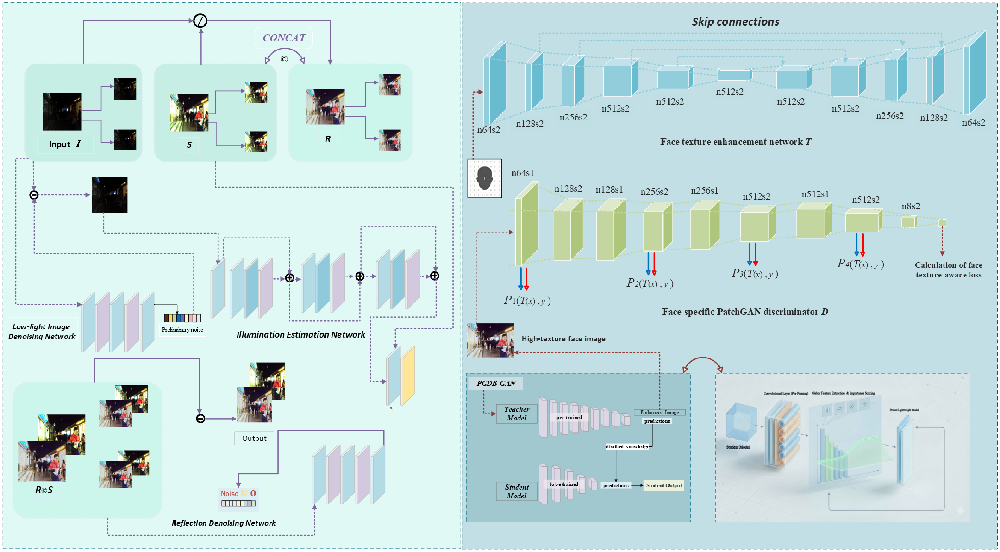
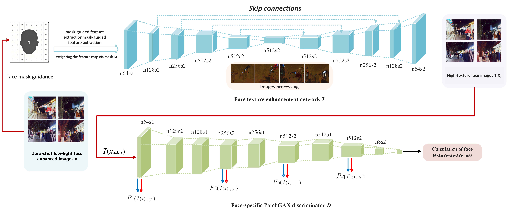
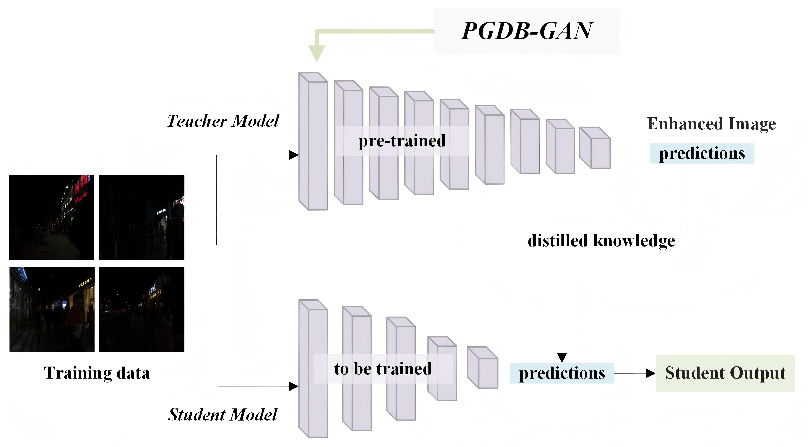
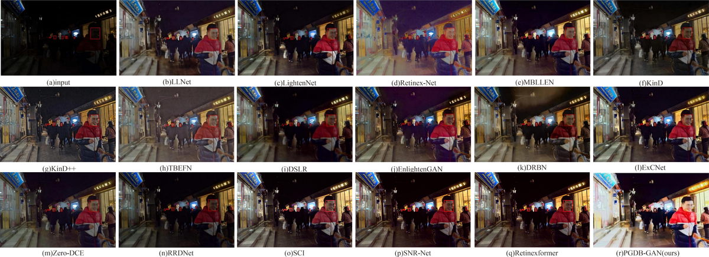
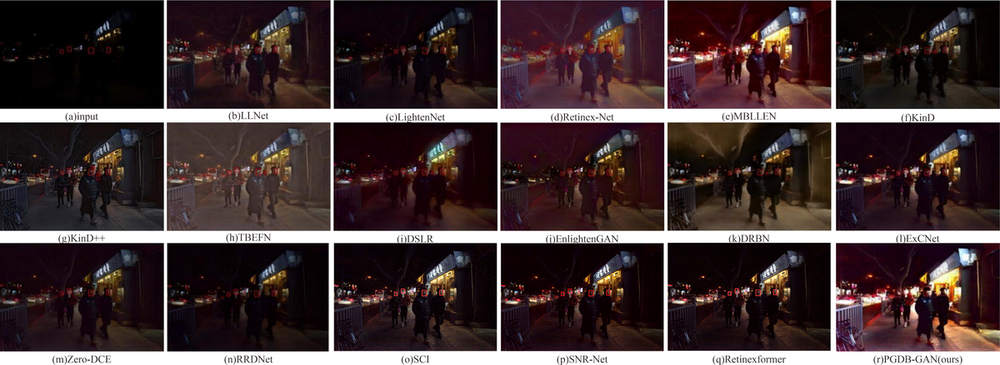
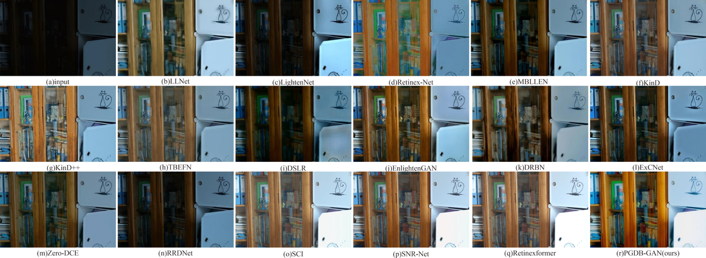
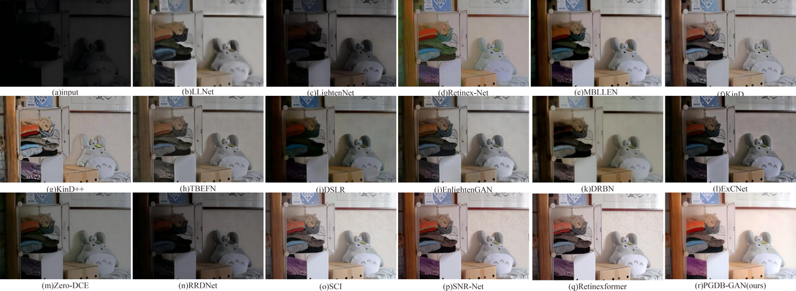
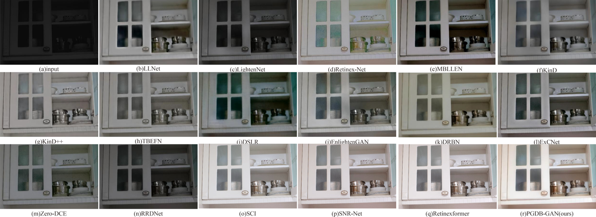

# PGDB-GAN: A Dynamic Enhancement Method for Low-Light Facial Features through Synergy of Physical Illumination and Adversarial Learning

**Official PyTorch Implementation**

[](https://doi.org/10.1016/j.asoc.2026.xxxxx)
[](LICENSE)
[](https://www.python.org/)
[](https://pytorch.org/)

**Authors:** Xianglong Yan, Jin Tao  
**Affiliation:** School of Artificial Intelligence, Gansu University of Political Science and Law, Lanzhou, China  
**Journal:** Applied Soft Computing (Elsevier, SCI Q1)  
**DOI:** https://doi.org/10.1016/j.asoc.2026.xxxxx  
**Repository:** https://github.com/mygithub88888888/PGDB-GAN

---

## Abstract

Complex, low-light environments significantly interfere with the extraction of facial texture features, directly affecting the accuracy of extraction and the effectiveness of applications. This paper proposes a **Physics-Guided, Dual-Branch Generative Adversarial Network (PGDB-GAN)** that establishes a dynamic synergy between physical illumination modeling and adversarial feature learning. Unlike existing sequential Retinex-GAN frameworks, we construct an illumination-reflectance decomposition model to provide real-time spatial guidance for the adversarial enhancement process. This decomposition, achieved through triple constraints—global brightness matching, pixel-wise adaptive adjustment, and illumination smoothness—acts as a physical consistency prior that constrains the search space of the dual-branch GAN, balancing noise suppression and luminance restoration. By adaptively leveraging these illumination priors, the generative adversarial module realizes the collaborative optimization of adversarial loss and content loss to prevent identity distortion in extreme darkness. Furthermore, a face-perceptual distillation module and a dynamic attention mechanism are integrated within this synergistic pipeline, while a Gabor filter bank is adopted to prioritize the preservation of multi-scale facial texture details. Finally, structured pruning and local variance reduction techniques are incorporated for model lightweighting. Extensive experiments demonstrate that our method outperforms other state-of-the-art approaches in both visual quality and facial structural fidelity.

---

## Key Contributions

- **Physics-Guided Synergy Framework with Dynamic Spatial Guidance:** Unlike traditional sequential Retinex-GAN methods, we propose a zero-reference framework that establishes a dynamic synergy between physical illumination modeling and adversarial learning. The Retinex-based illumination priors serve as real-time spatial guidance maps that constrain the GAN search space, effectively preventing identity distortion in extreme darkness.

- **Face-Specific Texture-Aware Enhancement via Gabor-Guided Coupling:** By coupling learnable Gabor filters with facial geometric priors, the model adaptively strengthens directional textures in discriminative regions, bridging the "physical-perceptual gap" and ensuring that high-frequency facial details are reconstructed with both structural accuracy and structural fidelity.

- **Hotspot-Aware Distillation for Detail-Preserving Model Optimization:** Instead of generic feature imitation, our strategy specifically transfers "texture-critical" attention and directional sensitivity from the teacher to a lightweight student network. Combined with structured pruning and Ghost modules, this achieves a balance between real-time inference (3 ms) and high-fidelity facial reconstruction.

---

## Overall Architecture



**Figure 1:** The overall architecture of PGDB-GAN, highlighting the dynamic synergy between physical illumination modeling and facial texture-aware adversarial learning. Unlike sequential pipelines, our framework integrates Retinex-based illumination priors as spatial guidance to constrain the dual-branch GAN enhancement.


**Figure 2:** Detailed network architecture of the decomposition and enhancement branches.



**Figure 3:** Zero-shot Low-light Face Texture Enhancement Framework with Mask Guidance. Comprises face texture enhancement network T (encoder-decoder with skip-connections, mask-guided module) and face-specific PatchGAN discriminator D.



**Figure 4:** Face-aware Gabor feature distillation framework.

---

## Repository Structure

```
PGDB-GAN/
├── src/                          # Core source code
│   ├── model.py                  # Base model: Enhancer, Denoise_1/2, Network, Finetunemodel
│   ├── model_gan.py              # GAN model: Generator and PatchGAN Discriminator
│   ├── loss.py                   # Loss functions: LossFunction, TextureDifference, SmoothLoss, L_TV
│   ├── loss_gan.py               # GAN-specific loss functions
│   ├── utils.py                  # Utility functions: Gaussian kernel, local variance, blur, downsampler
│   ├── utils_gan.py              # GAN utilities: Gabor filters, visualization, checkpoint management
│   ├── dataset.py                # Data loader for paired/unpaired image datasets
│   ├── dataset_gan.py            # GAN data loader with mask support
│   ├── distillation.py           # Face-aware knowledge distillation (Stage 2)
│   ├── pruning.py                # Gabor-driven structured pruning (Stage 3)
│   ├── generate_masks.py         # Preprocessing: face mask generation from annotations
│   ├── data_filter.py            # Data filtering utility based on face ratio
│   └── gan_*.py                  # Additional GAN variant modules
├── scripts/                      # Training and evaluation scripts
│   ├── train_stage1.py           # Stage 1: Base model training
│   ├── train_gan.py              # GAN training script
│   ├── test.py                   # Model inference and evaluation
│   ├── test_gan.py               # GAN model testing
│   ├── eval_baselines.sh          # Per-baseline evaluation manifest (v1.0.0)
│   ├── biometric_common.py        # Shared ArcFace/MTCNN embedding utilities
│   ├── identity_fidelity.py       # Experiment (1): DarkFace identity fidelity
│   ├── lfw_dark_biometric.py      # Experiments (2)/(3): LFW recognition + verification
│   ├── README_biometric.md        # Biometric protocol, commands, released results
│   ├── metrics.py                # Unified metric protocols (NSR/LPIPS/FID/NIQE)
│   ├── make_splits.py            # Generates the six split manifests in splits/
│   ├── run_five_seeds.py         # Five-seed batch runner (seeds 2,7,42,123,2024)
│   ├── validate_identity.py      # Identity preservation / verification / recognition
│   └── results/                   # Biometric result CSVs + per-run config JSONs
├── configs/                      # Configuration files
├── data/                         # Sample preprocessed training data
│   ├── data_choose/              # Selected low-light images + face annotations
│   │   ├── image/                # 42 low-light images
│   │   └── label/                # Face bounding-box labels
│   └── data_choose_denoise/      # Denoised variants with binary face masks
│       ├── image/
│       ├── label/
│       └── mask/                 # Binary face masks (.npy)
├── weights/                      # Pre-trained model weights
│   ├── LOL.pt                    # Final model, LOL dataset
│   ├── L-Nikon.pt                # Final model, DarkFace (Nikon-source subset)
│   ├── LSRW.pt                   # Final model, MIT-Adobe FiveK (LSRW pre-trained)
│   ├── weights_3000.pt           # Stage 1 base model (3000 epochs)
│   └── weights_100000.pt         # Stage 2 joint GAN training (100000 iterations)
├── figures/                      # Paper figures (PDF + PNG)
├── Visual comparison chart group/ # Paper qualitative comparison figures (PNG)
├── results/                      # Result CSVs for paper Tables 4, 5, 9
│   ├── lol.csv                   # Table 4 (LOL)
│   ├── darkface.csv              # Table 5 (DarkFace)
│   └── fivek.csv                 # Table 9 (MIT-Adobe FiveK)
├── splits/                       # File-level split manifests (Section 4.1)
│   ├── DarkFace_train.txt        # 6,000-image subject-disjoint train set
│   ├── DarkFace_test.txt         # 415-image subject-disjoint test set
│   └── README.md                 # Manifest documentation + generation guide
├── requirements.txt              # Python dependencies
├── README.md                     # This file
└── LICENSE                       # MIT License
```

---

## Data Preparation

### Datasets

PGDB-GAN is evaluated on three widely-used benchmarks. For exact reproducibility, the data splits used in our experiments are specified below. The public datasets are not redistributed in this repository; download them from the official sources listed in each subsection and arrange them in the directory layout shown.

#### LOL (LOw-Light) Dataset

- **Source:** Wei et al., BMVC 2018
- **Resolution:** 600 x 400 pixels
- **Train/Test Split:** 485 training pairs / 15 testing pairs (standard public split)
- **Format:** Paired low-light / normal-light images

```
data/LOL/
├── train/
│   ├── low/          # 485 low-light training images
│   └── high/         # 485 normal-light training images
└── test/
    ├── low/          # 15 low-light testing images
    └── high/         # 15 normal-light testing images (ground truth)
```

#### MIT-Adobe FiveK Dataset

- **Source:** Bychkovsky et al., CVPR 2011
- **Resolution:** Resized to 256 x 256 pixels for training and evaluation
- **Train/Test Split:** 4,500 training pairs / 500 testing pairs (Expert-C subset)
- **Format:** Paired RAW / Expert-C retouched images

```
data/FiveK/
├── train/
│   ├── input/        # 4,500 RAW training images
│   └── expert_c/     # 4,500 Expert-C retouched images
└── test/
    ├── input/        # 500 RAW testing images
    └── expert_c/     # 500 Expert-C retouched images
```

#### DarkFace Dataset

- **Source:** Yang et al., TPAMI 2022
- **Resolution:** Evaluated at 600 x 400 pixels
- **Split:** Subject-disjoint --- no individual appears in both training and testing sets
- **Format:** Unpaired low-light facial images with bounding box annotations

```
data/DarkFace/
├── train/
│   ├── image/        # Low-light training images
│   └── label/        # Bounding box annotations
└── test/
    ├── image/        # Low-light testing images
    └── label/        # Bounding box annotations
```

File-level split manifests are published in `splits/`: the two DarkFace manifests (6,000 training images / 415 test images, subject-disjoint) are shipped in this repository, and the LOL and MIT-Adobe FiveK manifests (485/15 and 4,500/500, the standard public splits) are generated with `python scripts/make_splits.py --data_root ./data` from the official downloads.

### Preprocessing

1. **Face Mask Generation:** Run `src/generate_masks.py` to construct binary face masks from bounding box annotations.
2. **Data Filtering:** Run `src/data_filter.py` to filter images based on face region ratio (IoU > 0.5 deduplication).
3. **Augmentation:** Training-time only --- random horizontal flipping and random resizing within [0.8, 1.2] scale range.
4. **Normalization:** All input images normalized to [0, 1]. No additional preprocessing during testing.

### Evaluation Resolution

All methods are evaluated at a consistent resolution per dataset: 600 x 400 for LOL, 256 x 256 for MIT-Adobe FiveK, and 600 x 400 for DarkFace. Input images are resized to the target resolution before inference.

---

## Module Descriptions

### Core Model (`src/model.py`)

| Class | Description |
|-------|-------------|
| `Denoise_1` | Single-stage denoising network for initial noise suppression |
| `Denoise_2` | Two-stage denoising network processing concatenated illumination-reflectance pairs |
| `Enhancer` | Multi-layer convolutional enhancement network with residual connections |
| `Network` | Full PGDB-GAN model integrating denoising, enhancement, and Retinex decomposition |
| `Finetunemodel` | Lightweight inference model loading pre-trained weights for deployment |

### Loss Functions (`src/loss.py`)

| Class | Description |
|-------|-------------|
| `LossFunction` | Composite loss integrating enhancement, reconstruction, color, illumination, and variance constraints |
| `TextureDifference` | Gabor-based texture difference computation for facial detail preservation |
| `SmoothLoss` | Anisotropic total variation regularization for illumination smoothness |
| `L_TV` | Weighted total variation loss with Gaussian-guided gradient coefficients |

### GAN Components (`src/model_gan.py`, `src/loss_gan.py`)

| Component | Description |
|-----------|-------------|
| Generator | Enhancer network for low-light facial image restoration |
| Discriminator | Face-specific PatchGAN discriminator for adversarial training |

### Distillation (`src/distillation.py`)

Face-aware knowledge distillation transferring texture-critical features from teacher to student network using:
- Deep feature alignment (VGG16 conv4_3 layer)
- Gabor feature alignment (multi-scale, multi-orientation Gabor filter bank)
- Face mask-guided attention focusing

### Pruning (`src/pruning.py`)

Gabor-driven structured channel pruning:
- Channel importance scoring via Gabor activation strength
- Threshold-based redundant channel removal
- Texture retention loss for post-pruning fine-tuning

---

## Hyperparameters

### Stage 1: Base Model Training

| Hyperparameter | Value | Description |
|:---|---:|:---|
| Batch Size | 16 | Training batch size |
| Epochs | 3000 | Total training epochs |
| Learning Rate | 2e-4 | Adam optimizer initial learning rate |
| Optimizer | Adam | Adaptive moment estimation |
| Gradient Clip Norm | 5.0 | Maximum gradient norm for clipping |
| Random Seed | 2 | Seed of the released weights; the paper's main tables are mean ± std over the five independent seeds 2, 7, 42, 123, 2024 |
| Enhancement Loss Weight | 700 | λ_enhan, global brightness matching |
| Pixel Adaptive Loss Weight | 1000 | λ_pixel, local brightness adaptation |
| Smoothness Loss Weight | 5 | λ_smooth, illumination smoothness |
| TV Loss Weight | 1600 | λ_tv, total variation regularization |
| Reconstruction Loss Weight | 1000 | λ_recon, paired downsampling consistency |
| Color Loss Weight | 10000 | λ_color, color consistency constraint |
| Illumination Loss Weight | 1000 | λ_ill, illumination component alignment |
| Variance Loss Weight | 1000 | λ_var, local variance consistency |

### Stage 2: Knowledge Distillation

| Hyperparameter | Value | Description |
|:---|---:|:---|
| Epochs | 5-10 | Distillation training epochs |
| Learning Rate | 1e-4 | Student network learning rate |
| λ_distill | 0.7 | Distillation loss weight |
| λ_gan | 0.1 | Adversarial loss weight |
| λ_gabor | 0.5 | Gabor feature loss weight |
| Temperature | 1.0 | Knowledge distillation temperature |
| λ_depth | 10 | Deep feature alignment weight |
| λ_gabor (align) | 5 | Gabor feature alignment weight |
| Gabor Orientations | 6 | Number of Gabor filter orientations |
| Gabor Frequency Bands | 2 | Number of frequency bands (low, mid) |

### Stage 3: Structured Pruning

| Hyperparameter | Value | Description |
|:---|---:|:---|
| Pruning Amount | 0.2-0.3 | Proportion of channels to prune |
| Compression Ratio | 91.5% | Model size reduction (15.54 MB → 1.32 MB) |
| Threshold Formula | τ = μ(s) - 2σ(s) | Channel importance threshold |
| Gabor Kernel Size | 3 | Gabor filter kernel size |

### Physical Prior Constants

| Constant | Value | Description |
|:---|---:|:---|
| α | 0.5 | Brightness scaling coefficient |
| β | 0.7 | Adaptive adjustment ratio base |
| ε | 1e-9 | Numerical stability epsilon |

---

## Training Configuration

### Hardware Environment

| Component | Specification |
|:---|:---|
| GPU | NVIDIA RTX 4060 Ti (16 GB VRAM) |
| CPU | Intel i7-10700K |
| RAM | 16 GB |
| OS | Windows 11 |
| CUDA | 11.2 |
| cuDNN | 8.1 |

### Software Environment

| Component | Version |
|:---|:---|
| Python | 3.8+ |
| PyTorch | 1.10+ |
| torchvision | 0.11+ |
| NumPy | 1.21+ |
| Pillow | 9.0+ |
| scikit-image | 0.19+ |
| Matplotlib | 3.5+ |
| thop | 0.1+ |
| scikit-learn | 1.0+ |
| tqdm | 4.62+ |

### Training Strategy

The PGDB-GAN is trained using a **three-stage pipeline**:

1. **Stage 1 — Base Model Training:** End-to-end training of the full-parameter model with physics-guided synergy. The illumination decomposition network (IE-Net) and GAN are jointly optimized with the composite loss function L_total.

2. **Stage 2 — Face-Aware Distillation:** Knowledge transfer from the heavy teacher network to a lightweight student network. Gabor feature alignment and face mask-guided attention ensure texture fidelity in discriminative facial regions.

3. **Stage 3 — Gabor-Driven Pruning:** Structured channel pruning based on Gabor feature sensitivity scores. Post-pruning fine-tuning with texture retention loss preserves facial detail quality.

### Optimizer Configuration

| Parameter | Value |
|:---|:---|
| Optimizer | Adam |
| β₁ | 0.5 |
| β₂ | 0.999 |
| Weight Decay | 0 (implicit via loss) |
| Learning Rate Schedule | Constant (Stage 1), Reduce-on-Plateau (Stage 2) |

### Reproducibility Settings

Every quantitative result reported in the paper (Tables 4, 5, 6, 9, 11, 12 and 13) is the **mean ± standard deviation over five independent training runs**. Each run is initialized with a distinct seed from the fixed set `2, 7, 42, 123, 2024`, applied identically to PyTorch (`torch.manual_seed`, `torch.cuda.manual_seed`), NumPy, and Python's built-in `random` module. The datasets, splits, hyper-parameters, and training protocol are identical across the five runs; the trials therefore differ only in their independent random initializations and mini-batch orderings and are mutually independent.

| Component | Setting |
|:---|:---|
| Seed set (five independent runs) | `2, 7, 42, 123, 2024` |
| PyTorch seed | `torch.manual_seed(seed)` |
| CUDA seed | `torch.cuda.manual_seed(seed)` |
| NumPy seed | `np.random.seed(seed)` |
| Python random | `random.seed(seed)` |
| cuDNN | `benchmark=True`, `deterministic=False` |

All training and evaluation scripts accept a `--seed` argument (default: 2). The pre-trained checkpoints released in `weights/` correspond to the **seed-2 run** of the five. The five runs are automated by `scripts/run_five_seeds.py`.

---

## Pre-trained Models

Pre-trained model weights are provided for immediate inference and fine-tuning on different datasets.

| Model | Dataset / stage | Size | Description | Download |
|:---|:---|:---|:---|:---|
| `LOL.pt` | LOL | 358,020 B | Final model, LOL dataset | [weights/LOL.pt](weights/LOL.pt) |
| `L-Nikon.pt` | DarkFace (Nikon-source subset) | 358,020 B | Final model, DarkFace/Nikon subset | [weights/L-Nikon.pt](weights/L-Nikon.pt) |
| `LSRW.pt` | MIT-Adobe FiveK (LSRW pre-trained) | 358,020 B | Final model, MIT-Adobe FiveK | [weights/LSRW.pt](weights/LSRW.pt) |
| `weights_3000.pt` | Stage 1 (LOL) | 358,488 B | Stage 1 base model (3000 epochs) | [weights/weights_3000.pt](weights/weights_3000.pt) |
| `weights_100000.pt` | Stage 2 (LOL) | 3,013,544 B | Stage 2 joint GAN training (100000 iterations) | [weights/weights_100000.pt](weights/weights_100000.pt) |
### Usage

```python
from src.model import Finetunemodel

model = Finetunemodel('weights/LOL.pt')
model = model.cuda()
model.eval()

with torch.no_grad():
    enhance, denoised = model(input_tensor)
```

---

## Efficiency Metrics

| Metric | Value | Platform |
|:---|---:|:---|
| Parameters (after pruning) | 1.320 M | PyTorch |
| FLOPs | 74.200 G | PyTorch |
| Inference Time (720P) | 0.003 s (3 ms) | NVIDIA RTX 4060 Ti |
| Model Size (before pruning) | 15.54 MB | — |
| Model Size (after pruning) | 1.32 MB | — |
| Compression Ratio | 91.5% | — |

### Comparison with State-of-the-Art Methods

| Method | Params (M) | FLOPs (G) | Platform |
|:---|---:|---:|:---|
| LLNet | 17.908 | 4124.177 | Theano |
| Retinex-Net | 0.555 | 587.470 | TensorFlow |
| KinD | 8.160 | 574.954 | TensorFlow |
| EnlightenGAN | 8.637 | 273.240 | PyTorch |
| Zero-DCE | 0.079 | 84.990 | PyTorch |
| SCI | 8.620 | 28.510 | PyTorch |
| SNR-Net | 4.010 | 26.350 | PyTorch |
| Retinexformer | 1.610 | 15.570 | PyTorch |
| **PGDB-GAN (Ours)** | **1.320** | **74.200** | PyTorch |

PGDB-GAN achieves a remarkable balance: the most compact parameter count among competitive methods (1.320 M), ultra-fast 3 ms inference matching Zero-DCE speed, while delivering superior restoration quality across all quantitative metrics.

> **Note on runtime comparison:** Because each method is implemented in its own framework (PyTorch, TensorFlow, Theano, MATLAB), runtimes are not compared across methods; the framework-agnostic metrics (parameter count and FLOPs) provide the comparable basis for cross-method efficiency assessment.

---

## Experimental Results

### Quantitative Results on LOL Dataset

| Method | PSNR (dB)↑ | SSIM↑ | NSR↑ | LPIPS↓ | FID↓ | NIQE↓ |
|:---|---:|---:|---:|---:|---:|---:|
| Input | 7.773 | 0.181 | 19.41% | 0.562 | 128.54 | 8.72 |
| KinD++ | 21.314 | 0.812 | 55.83% | 0.207 | 43.26 | 4.48 |
| SNR-Net | 24.610 | 0.842 | 65.18% | 0.192 | 36.42 | 4.12 |
| Retinexformer | 25.160 | 0.845 | 68.34% | 0.187 | 33.14 | 3.86 |
| **PGDB-GAN** | **29.670** | **0.941** | **82.31%** | **0.173** | **22.37** | **3.18** |

### Quantitative Results on DarkFace Dataset

| Method | NSR↑ | LPIPS↓ | FID↓ | NIQE↓ |
|:---|---:|---:|---:|---:|
| Input | 0.00% | 0.000 | 0.00 | 9.27 |
| SCI | 71.24% | 0.385 | 48.92 | 4.89 |
| SNR-Net | 74.16% | 0.263 | 46.27 | 4.61 |
| Retinexformer | 76.83% | 0.244 | 41.58 | 4.13 |
| **PGDB-GAN** | **86.41%** | **0.206** | **25.69** | **3.42** |

### Visual Results



**Figure 6-8:** Visual comparison on LOL-test datasets. PGDB-GAN consistently recovers finer facial textures and maintains natural color fidelity compared to existing methods.



**Figures 9-11:** Visual comparison on DarkFace datasets. Red bounding boxes indicate successful face detection; PGDB-GAN preserves facial identity features even under extreme low-light conditions.





**Figures 12-14:** Additional visual comparisons demonstrating the robustness of PGDB-GAN across diverse lighting conditions.

### Downstream Face Detection Performance

| Method | 1× (Close-up) | 2× (Mid-dist) | 4× (Long-dist) |
|:---|---:|---:|---:|
| Input | 0.3313 | 0.3311 | 0.3301 |
| SCI | 0.9580 | 0.9924 | 0.6348 |
| SNR-Net | 0.9984 | 0.9871 | 0.6379 |
| Retinexformer | 0.9268 | 0.9919 | 0.8608 |
| **PGDB-GAN** | **0.9991** | **0.9984** | **0.9737** |


**Downstream face detection comparison:** MTCNN detection results under varying downsampling scales (x1, x2, x4) comparing PGDB-GAN with SCI, SNR-Net, and Retinexformer. Red bounding boxes indicate successful detections with confidence scores; orange "Missed" labels indicate complete localization failures. PGDB-GAN uniquely preserves facial geometric topology under severe x4 degradation, maintaining an average confidence of 0.9737 where competing methods fail.

---

## Visual Comparison

### LOL Dataset

PGDB-GAN outperforms all compared methods on the LOL benchmark, achieving superior noise suppression and detail recovery with minimal artifacts. The enhanced outputs exhibit natural illumination, sharp facial contours, and faithful texture preservation compared to competing approaches.


### DarkFace Dataset

On the challenging unpaired DarkFace benchmark, PGDB-GAN demonstrates exceptional zero-shot generalization. The enhanced faces exhibit naturally balanced illumination and well-preserved structural details, while competing methods frequently suffer from over-exposure, color shifts, or residual noise artifacts.


### MIT-Adobe FiveK Dataset

PGDB-GAN generalizes effectively to general-purpose enhancement on the MIT-Adobe FiveK dataset, delivering balanced exposure and natural color rendition. The physical guidance mechanism ensures that enhancement remains visually realistic without introducing hallucinated textures.


---

## Getting Started

### 1. Environment Setup

```bash
# Clone repository
git clone https://github.com/mygithub88888888/PGDB-GAN.git
cd PGDB-GAN

# Install dependencies
pip install -r requirements.txt
```

### 2. Data Preparation

Prepare your dataset in the following structure:
```
data/
├── train/
│   └── low/          # Low-light training images
├── test/
│   └── low/          # Low-light test images
└── masks/            # (Optional) Face masks for distillation
```

Generate face masks from annotations:
```bash
python src/generate_masks.py \
    --image_dir ./data/train/low \
    --annotation_dir ./data/annotations \
    --mask_dir ./data/masks
```

### 3. Three-Stage Training

#### Stage 1: Base Model Training

```bash
python scripts/train_stage1.py \
    --batch_size 16 \
    --lr 2e-4 \
    --epochs 3000 \
    --gpu 0 \
    --seed 2 \
    --save ./results/stage1
```

#### Stage 2: Face-Aware Knowledge Distillation

```bash
python src/distillation.py \
    --teacher_path ./results/stage1/model_epochs/weights_3000.pt \
    --epochs 10 \
    --lr 1e-4
```

#### Stage 3: Gabor-Driven Structured Pruning

```bash
python src/pruning.py \
    --model_path ./checkpoints/student/best.pth \
    --prune_amount 0.3
```

### 4. Testing & Evaluation

```bash
python scripts/test.py     --data_path_test_low ./data/test/low     --model_test ./weights/LOL.pt     --save ./results/test     --seed 2     --gpu 0
```

**Metrics computed:** PSNR, SSIM, LPIPS, FID, NIQE, NSR, MSE

**DarkFace evaluation protocols (unpaired, no ground truth):**

| Metric | Protocol |
|:---|:---|
| LPIPS | AlexNet-based, enhanced output vs. original low-light input |
| FID | Inception-v3 (pool3), images resized to 299x299, reference = original low-light test set |
| NSR | Wavelet-domain MAD estimator (Daubechies-4, sigma = MAD/0.6745), NSR = (sigma_input - sigma_enhanced) / sigma_input x 100% |
| NIQE | Standard implementation with default parameters |

For paired datasets (LOL, MIT-Adobe FiveK), reference-based metrics (PSNR, SSIM, MSE, LPIPS) use the corresponding ground-truth normal-light images.

### 5. Reproducing Paper Results

To fully reproduce the experimental results reported in the paper:

1. Download datasets: [LOL](https://daooshee.github.io/BMVC2018website/), [DarkFace](https://flyywh.github.io/CVPRW2019LowLight/), [MIT-Adobe FiveK](https://data.csail.mit.edu/graphics/fivek/)
2. Train Stage 1 on LOL dataset (~3000 epochs, ~8 hours on RTX 4060 Ti)
3. Distill with face masks (~10 epochs, ~2 hours)
4. Apply structured pruning (post-processing)
5. Evaluate using provided test scripts

---

## Reproducibility: Releases, Baselines, Commands & Result Files

> This section provides the exact, machine-checkable reproducibility record for the paper.
> All commit hashes below were verified against the corresponding public GitHub repositories on **2026-08-20**.

### Release pinning

| Item | Value |
|:---|:---|
| Repository | https://github.com/mygithub88888888/PGDB-GAN |
| Default branch | `main` |
| Release commit (tag `v1.0.0`) | `b4b0634f73b4395a29d371bad1d9595914d56f59` |
| Release tag | `v1.0.0` (attached to the commit above) |

> The release commit contains the complete v1.0.0 source code with all entry-point imports wired to the `src/` package (repository self-check below), pre-trained weights (`weights/`), result CSVs (Tables 4, 5, 9, 13), the biometric evaluation files (`scripts/results/` and the `*biometric*` scripts), and `scripts/eval_baselines.sh`. Subsequent commits on `main` after the release commit are documentation-only README updates; `git rev-list -n 1 v1.0.0` returns the release hash recorded on the main-branch README.

### Software environment

| Component | Specification (per paper, Section 4.1) |
|:---|:---|
| OS | Windows 11 |
| GPU / CPU | NVIDIA RTX 4060 Ti 16 GB / Intel i7-10700K |
| RAM | 16 GB |
| Storage | 512 GB SSD |
| Python / PyTorch / torchvision | PyTorch 2.5.1 with CUDA 12.1 and cuDNN 8.9; requirement range Python 3.8+ / PyTorch 1.10+ / torchvision 0.11+ (`requirements.txt`) |
| CUDA / cuDNN | 12.1 / 8.9 |
| numpy / opencv-python / scikit-image | >=1.21.0 / >=4.5.0 / >=0.19.0 |

### Hyper-parameter mapping (paper symbols ↔ released code)

The loss hyper-parameters reported in the paper (Section 3 equations and Table 2) map to the released code as follows (values follow the paper; the code was aligned to them):

| Paper symbol | Value | Released code location |
|:---|:---|:---|
| λ_light (illumination loss L_over + L_pix + L_smooth) | 1.0 (unit weight in the total loss) | stage-1 objective in `src/loss.py` |
| λ_content (content loss L1_mask) | 10.0 | masked L1 content term of the joint objective (Table 2 of the paper) |
| λ_distill (distillation loss) | 0.7 | `lambda_distill` in `src/distillation.py` |
| λ_tex (texture-retention loss, Table 2) | 0.5 | texture-retention loss of the pruning fine-tuning stage (paper Section 3.4); the released `src/pruning.py` performs the structured pruning itself |
| λ_gan (GAN loss) | 0.1 | `lambda_gan` in `src/distillation.py` |
| λ_adv / λ_per / λ_gram (texture-GAN branch internal weights) | 1 / 10 / 50 | coefficients of `adv_loss` / `percep_loss` / `recon_loss` in `src/gan_losses.py` |
| λ_depth / λ_gabor (inside L_distill) | 1 / 0.5 | L_distill = L_depth + 0.5·L_gabor in `face_aware_distillation_loss` (`src/distillation.py`), scaled by λ_distill = 0.7 in the joint objective |
| λ_reg (L2 weight decay) | 1e-4 | Adam `weight_decay=1e-4` in `scripts/train_stage1.py` and `scripts/train_gan.py` |

### PGDB-GAN checkpoints (actual files in `weights/`)

| File in `weights/` | Dataset / stage |
|:---|:---|
| `weights_3000.pt` | Stage 1 base model (3000 epochs) |
| `weights_100000.pt` | Stage 2 joint GAN training (100000 iterations) |
| `LOL.pt` | Final model, LOL dataset |
| `L-Nikon.pt` | Final model, DarkFace/Nikon subset |
| `LSRW.pt` | Final model, LSRW/MIT-Adobe FiveK subset |

### Baselines: exact repositories, commits, and checkpoints used

All compared methods were evaluated with their **official pre-trained checkpoints** (no fine-tuning/retraining), under the same splits, preprocessing, resolutions, and metric protocols as the paper. The sole exception is LightenNet: no public official implementation or checkpoint exists, and its reported values are cited from the original paper (as marked in the table). Commit hashes below are the exact states of the official repositories used for the reported results (verified on 2026-08-20).

| Method | Official repository | Commit (verified) | Pretrained checkpoint / weights |
|:---|:---|:---|:---|
| LLNet | color version (official): [kglore/llnet_color](https://github.com/kglore/llnet_color) | `1d45245ec2f6439ffd67848e05daa104412e3755` | model object downloaded via the link in the repo README |
| LightenNet | no public official code or checkpoint exists; reported values cited from the original paper | — | — |
| Retinex-Net | [weichen582/RetinexNet](https://github.com/weichen582/RetinexNet) | `fdc15ebc179209d17c77371a825df351a5be3ff5` | checkpoints under `./checkpoint` per repo README |
| MBLLEN | [Lvfeifan/MBLLEN](https://github.com/Lvfeifan/MBLLEN) | `69f6dc7ac35e4e1e5d79e74d2738cca033f5d563` | `Syn_img_lowlight_withnoise.h5`, `LOL_img_lowlight.h5` |
| KinD | [zhangyhuaee/KinD](https://github.com/zhangyhuaee/KinD) | `b7d7fcca6d70e1fcb588ad6935ec7750e96c7161` | official checkpoints (Baidu/Google Drive links in repo README) |
| KinD++ | [zhangyhuaee/KinD_plus](https://github.com/zhangyhuaee/KinD_plus) | `6e50ecdbf092420276bf4cf18f7343110b20e17f` | official checkpoints (Drive/Baidu links in repo README) |
| TBEFN | [lukun199/TBEFN](https://github.com/lukun199/TBEFN) | `c9181c7a4fc05a7f0050847a858c97268511701c` | `./ckpt` (provided in repo) |
| DSLR | [SeokjaeLIM/DSLR-release](https://github.com/SeokjaeLIM/DSLR-release) | `861429482faf50ee3d6570948af8c48df1fc7f43` | pretrained model via Drive link in repo README |
| EnlightenGAN | [VITA-Group/EnlightenGAN](https://github.com/VITA-Group/EnlightenGAN) | `b0349848f0cd1e52317baa04e09ac32a2ae771d6` | pretrained generator + VGG16 (Drive links in repo README) |
| DRBN | [flyywh/CVPR-2020-Semi-Low-Light](https://github.com/flyywh/CVPR-2020-Semi-Low-Light) | `9f383decbd2717ab37bb9e4c133b3a0bf98ba638` | official checkpoints (per repo README) |
| ExCNet | [csLinZhang/ExCNet](https://github.com/csLinZhang/ExCNet) | `440c3d8572658d3eab3a570cf9e35bfe06478953` | official notebook `ExCNet.ipynb` executed as-is; no separate pretrained checkpoint file in the repo |
| Zero-DCE | [Li-Chongyi/Zero-DCE](https://github.com/Li-Chongyi/Zero-DCE) | `e0f4adc54d0f23348c4a9b84acc08fe8778d5bfd` | `Epoch99.pth` |
| RRDNet | [aaaaangel/RRDNet](https://github.com/aaaaangel/RRDNet) | `d1dce2a2069777a64bd335c210cee91e0e03a86e` | none required (zero-shot Retinex decomposition) |
| SCI | [vis-opt-group/SCI](https://github.com/vis-opt-group/SCI) | `f6f88fd73cd614dbeee17d61a0dbde3678b7e183` | official weights bundled in the repo: `CVPR/weights/easy.pt`, `CVPR/weights/medium.pt`, `CVPR/weights/difficult.pt`, `TPAMI/weights/weights_1_3500.pt` |
| SNR-Net | [JIA-Lab-research/SNR-Aware-Low-Light-Enhance](https://github.com/JIA-Lab-research/SNR-Aware-Low-Light-Enhance) | `1113144c82adc8bcc4a9ec27749ed75f196a4e4d` | weights not bundled in the repo; official download links in the repo README, loaded via `pretrain_model_G` in `options/test/*.yml` |
| Retinexformer | [caiyuanhao1998/Retinexformer](https://github.com/caiyuanhao1998/Retinexformer) | `1e9a0efce4b306b6701b824768370ff26066c32a` | weights not bundled in the repo; official Google Drive/Baidu download links in the repo README |

### Execution commands

```bash
# Stage 1 (physical foundation initialization: Adam, lr 2e-4, batch size 16, 3000 epochs)
python scripts/train_stage1.py --batch_size 16 --lr 2e-4 --epochs 3000 --seed <seed> --gpu 0 --save ./results/stage1

# Stage 2 (joint GAN fine-tuning: the 100,000 iterations of Stage 2; the script's
# "--epochs" value is the iteration counter and saves weights_<counter>.pt)
python scripts/train_gan.py --model_pretrain ./results/stage1/model_epochs/weights_3000.pt --batch_size 16 --lr 1e-4 --epochs 100000 --seed <seed> --gpu 0 --save ./results/stage2

# Stage 3 (hotspot-aware knowledge distillation and structured pruning).
# These scripts take no command-line arguments: the paths, batch size, and pruning
# amount (0.2) are configured at the top of src/distillation.py and src/pruning.py.
python src/distillation.py
python src/pruning.py

# Evaluation (LOL / DarkFace / FiveK) with the released weights
python scripts/test.py --data_path_test_low ./data/test/low --model_test ./weights/LOL.pt --save ./results/test --seed <seed> --gpu 0

# Dataset directories are hard-coded in the DataLoader block of each training script
# (train_stage1.py: ./datasets/data_choose/image; train_gan.py: ./datasets/JIAGAN/image);
# point them to the local dataset layout. The repository ships the preprocessed sample
# folders data/data_choose and data/data_choose_denoise (42 images each); the full public
# datasets must be downloaded from the official sources listed in "Data Preparation".

# Baselines: the exact per-method commands (official repository at the recorded commit +
# official pretrained checkpoint) are consolidated in scripts/eval_baselines.sh.
```

### Runnable entry points (repository self-check)

Every entry point below was re-verified at release `v1.0.0`: all scripts import only modules that exist in this repository; every file in `src/` and `scripts/` passes `python -m py_compile`; and every command-line entry point completes `python <entry> --help` with exit code 0 (`train_stage1.py`, `train_gan.py`, `test.py`, `test_gan.py`, `metrics.py`, `validate_identity.py`, `run_five_seeds.py`, `make_splits.py`).

| Entry point | Purpose |
|:---|:---|
| `scripts/train_stage1.py` | Stage 1 base training (`--batch_size 16 --lr 2e-4 --epochs 3000 --seed 2`) |
| `scripts/train_gan.py` | Stage 2 joint GAN training (100,000 iterations) |
| `src/distillation.py` | Stage 3 hotspot-aware distillation |
| `src/pruning.py` | Stage 3 structured pruning |
| `scripts/test.py` | Enhancement evaluation (PSNR/SSIM/MSE/NSR/LPIPS/FID/NIQE) |
| `scripts/metrics.py` | Metric computation (paper Section 4.2 protocols) |
| `scripts/validate_identity.py` | Identity preservation / verification / recognition (paper Section 4.6) |
| `scripts/run_five_seeds.py` | Five independent runs with seeds `2, 7, 42, 123, 2024` |
| `scripts/make_splits.py` | Regenerates the LOL / MIT-Adobe FiveK split manifests |

The forward pass of `src/model.py` (Stage 1) and `src/model_gan.py` (Stage 2) runs on random input tensors, and the DataLoader in `src/dataset.py` returns `(low, img_name)` without masks and `(low, img_name, face_mask)` when a mask directory is supplied.

### Result files (paper Tables 4, 5, 9, 13)

The exact numbers reported in Tables 4, 5 and 9 of the paper are published as CSV files in `results/`:

| Paper table | File |
|:---|:---|
| Table 4 (LOL) | [results/lol.csv](results/lol.csv) |
| Table 5 (DarkFace) | [results/darkface.csv](results/darkface.csv) |
| Table 9 (MIT-Adobe FiveK) | [results/fivek.csv](results/fivek.csv) |
| Table 13 (loss-level & interaction ablation, LOL) | [results/Table13_loss_ablation.csv](results/Table13_loss_ablation.csv) |

**DarkFace identity baseline note (Table 5):** the `input` row is the identity baseline. Under the DarkFace protocols (LPIPS vs. the low-light input, FID with the low-light test set as reference, NSR = (sigma_input - sigma_enhanced)/sigma_input), NSR, LPIPS and FID of the identity mapping are **exactly zero by construction** (`0.00% / 0.000 / 0.00`). The row is reported as a zero-reference self-check of the evaluation pipeline and is excluded from the method ranking; NIQE (9.27) is the absolute no-reference quality of the raw input.

### Biometric evaluation files (recognition, verification, identity preservation)

The controlled low-light biometric benchmark reported in the paper (LFW View-2 fold 1: 300 genuine / 300 impostor pairs; ArcFace `w600k_r50` embeddings; landmarks detected on the normal-light counterpart and reused across all conditions; DarkFace identity fidelity with the low-light input as reference) is released as:

| Experiment | File |
|:---|:---|
| (1) Identity fidelity (DarkFace) | [scripts/results/biometric_identity_fidelity.csv](scripts/results/biometric_identity_fidelity.csv) |
| (2) Recognition (LFW, Rank-1..5) | [scripts/results/biometric_recognition_lfw.csv](scripts/results/biometric_recognition_lfw.csv) |
| (3) Verification (LFW, AUC / TAR@FAR) | [scripts/results/biometric_verification_lfw.csv](scripts/results/biometric_verification_lfw.csv) |

Scripts: [scripts/identity_fidelity.py](scripts/identity_fidelity.py), [scripts/lfw_dark_biometric.py](scripts/lfw_dark_biometric.py), [scripts/biometric_common.py](scripts/biometric_common.py). The full protocol, data layout, and commands are in [scripts/README_biometric.md](scripts/README_biometric.md); each CSV is accompanied by a `*_config.json` recording all paths, degradation parameters, model names, and sample counts. Baseline checkpoints: SCI `medium.pt`, SNR-Net `LOLv1.pth`, Retinexformer `LOL_v1.pth` (official repositories at the recorded commits); PGDB-GAN `weights/LSRW.pt`.

### Loss-level and interaction ablation (paper Table 13)

The loss-level and interaction ablation reported in Table 13 of the paper is published as `results/Table13_loss_ablation.csv` (mean ± std over five independent seeds). Protocol: every variant is trained with the **identical three-stage training protocol, initialization, random seeds, and hyper-parameters as the full model of paper Table 11 (LOL)**; the only difference is the ablated loss term(s). Notation follows the paper: `L_light = L_over + L_pix + L_smooth`, `L_content = L1_mask`. Each loss term is disabled by zeroing its coefficient in the training objective of the released training scripts — L_light in `src/loss.py`, L_content and L_GAN in `src/model_gan.py`, and L_distill in `src/distillation.py` (L_tex is the texture-retention loss of the pruning fine-tuning stage, paper Section 3.4); no other code, data, or hyper-parameter is changed. The numerical regularizers (`L_tv` and the weight-decay term) remain enabled in all variants. The `w/o L_GAN` and `Full model (all losses)` rows reproduce the corresponding configurations of Table 11 exactly. Seeds: `2, 7, 42, 123, 2024`. Evaluation: LOL test split (15 images) with `scripts/metrics.py`, the same metric protocol used for Tables 4 and 11 (PSNR / SSIM / NSR / LPIPS / MSE / FID / NIQE).

### Verifying this record

Every item above can be confirmed without re-running any training:

1. `git clone https://github.com/mygithub88888888/PGDB-GAN && cd PGDB-GAN`
2. `git rev-list -n 1 v1.0.0` must equal the release commit recorded on the main-branch README
3. `git show v1.0.0:README.md` contains this reproducibility record
4. Verify each baseline commit hash against the corresponding official repository
5. Compare `results/lol.csv`, `results/darkface.csv`, `results/fivek.csv` with paper Tables 4, 5 and 9
6. `scripts/eval_baselines.sh` contains the exact per-baseline evaluation commands
7. Compare `scripts/results/biometric_identity_fidelity.csv`, `biometric_recognition_lfw.csv` and `biometric_verification_lfw.csv` with the biometric evaluation table in the paper
8. Compare `results/Table13_loss_ablation.csv` with the loss-level and interaction ablation table (Table 13) in the paper
9. Confirm the split manifests: `splits/DarkFace_train.txt` (6,000 lines) and `splits/DarkFace_test.txt` (415 lines); regenerate the LOL/FiveK manifests with `scripts/make_splits.py`
10. Confirm the five-seed protocol: `scripts/run_five_seeds.py` uses seeds `2, 7, 42, 123, 2024`, and the released `weights/` checkpoints correspond to the seed-2 run
11. Run the repository self-check: `python -m py_compile src/*.py scripts/*.py` and `python scripts/<entry>.py --help` for `train_stage1.py`, `train_gan.py`, `test.py`, `test_gan.py`, `metrics.py`, `validate_identity.py` (all exit with code 0)

---

## License

This project is released under the [MIT License](LICENSE).

---

## Citation

If you find our work helpful in your research, please cite:

```bibtex
@article{tao2026pgdb,
  title={PGDB-GAN: A Dynamic Enhancement Method for Low-Light Facial Features through Synergy of Physical Illumination and Adversarial Learning},
  author={Yan, Xianglong and Tao, Jin},
  journal={Applied Soft Computing},
  year={2026},
  publisher={Elsevier},
  doi={10.1016/j.asoc.2026.xxxxx}
}
```

---

## Acknowledgments

This work was supported by the School of Artificial Intelligence, Gansu University of Political Science and Law. The authors thank the anonymous reviewers for their constructive feedback that significantly improved this work.

---

## Contact

For questions regarding the implementation or the paper:

- **Xianglong Yan** — School of Artificial Intelligence, Gansu University of Political Science and Law
- **Jin Tao** — 359071039@qq.com

Please open an [issue](https://github.com/mygithub88888888/PGDB-GAN/issues) for code-related questions.

---

## Changelog

| Version | Date | Description |
|:---|:---|:---|
| v1.0.0 | 2026-08-21 | Initial release: clean codebase with all entry-point imports wired to `src/` (repository self-check passes), pre-trained weights, comprehensive documentation, and the complete reproducibility record (baseline pins, result CSVs, biometric evaluation files, loss-level ablation CSV, five-seed protocol) |


